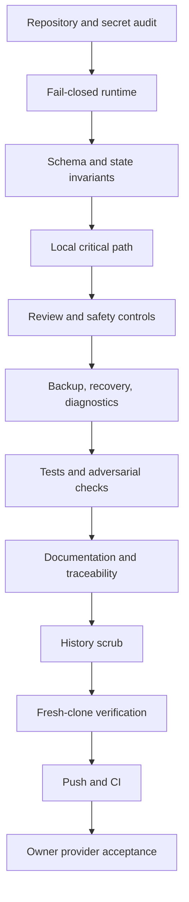

# Task Graph and Stabilization Gates

Gates A-K are repository work. Gate L remains blocked by credential rotation, provider permission, private account access, and manual operator evidence. A failed gate stops release claims but does not erase completed local work.

